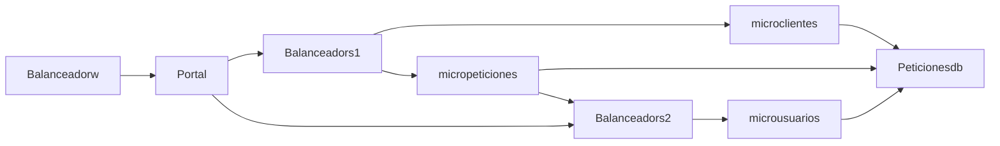

# Arquitectura

## Comunicacion entre Servicios
A continuación se gráfica la comunicación entre los servicios configurados en el docker compose.



### Servicios

Tenga en cuenta revisar la IP del servidorUbuntu para este ejercicio se utilizó la 192.168.100.2

Servicio | Url Directa | Balanceador | Url Balanceador |  Descripción
------------ | ------------ | ------------- | ------------- | -------------
Portal | http://192.168.100.2:3000 | Balanceadorw | http://192.168.100.2:5080/ | Portal
microclientes | http://192.168.100.2:3001 | Balanceadors1 | http://192.168.100.2:5081/ | Servicio Microclientes
micropeticiones | http://192.168.100.2:3003 | Balanceadors1 | http://192.168.100.2:5083/ | Servicio Micropeticiones
microusuarios | http://192.168.100.2:3002 | Balanceadors2 | http://192.168.100.2:5082/ | Servicio Microusuarios

### Configuración base de datos

Base de Datos | Puerto del Contenedor | Puerto Host
------------ | ------------ | ------------
Peticionesdb | 3306 | 32000

### Estadísticas de los balanceadores

Servicio | Url |  Descripción
------------ | ------------ | -------------
Balanceadorw | http://192.168.100.2:5080/haproxy?stats | Estadisticas del Balanceador del Portal
Balanceadors1 | http://192.168.100.2:5081/haproxy?stats | Estadísticas del Balanceador de los servicios de peticiones y clientes
Balanceadors2 | http://192.168.100.2:5082/haproxy?stats | Estadísticas del Balanceador del servicio de usuarios

### Servicio temporal de carga de información

El servicio insertadditionaldata, se utiliza para cargar la información inicial utilizando el archivo .cvs. Extrae los clientes y los usuarios y los crea en la base de datos de Peticiones en MySQL mediante codigo Python

### Consideraciones de despliegue Deshabilitadas

El archivo de Docker compose tiene en comentario la configuración para desplegar los contenedores en determinados roles. Si se desea realizar esta prueba realice la configuración de acuerdo al docker-compose. La configruación está para una Arquitectura de 3 Capas: Presentación, Servicios  y Base de Datos y en medio de ellas los Balanceadores.

Capa | Servicio | Role
------------ | ------------ | -------------
Presentación | Portal | serverportal
Servicios | micropeticiones | serverservices
Servicios | microclientes | serverservices
Servicios | microusuarios | serverservices
Base de Datos | Peticionesdb | serverstorage
Balanceador | Balanceadorw | loadbalancer
Balanceador | Balanceadors1 | loadbalancer
Balanceador | Balanceadors2 | loadbalancer

#### Configuraciones

Este ejemplo de configuración es para un despliegue en 4 servidores

```sh
docker node update --label-add role=loadbalancer servidorUbuntu
docker node update --label-add role=portal clienteUbuntu
docker node update --label-add role=services servicesUbuntu
docker node update --label-add role=database storageUbuntu

```

### Ejecutar el docker compose
```sh
# Ejecutar el Docker componse
docker compose up -d 

# Verificar que estén corriendo los contenedores 
docker compose ps 

# Detener los contenedores
docker compose down
```

### Procesos de escalamiento con Docker Swarn

Asegurar tener configurado el cluster antes de ejecutar los siguientes comandos.
Todas las imagenes y sus contenedores inician por: "proyectofinal-"

```sh
# Desplegar el Docker Componse en el Swarm
docker stack deploy -c docker-compose.yml projectofinal

#Consultar los stack creado
docker stack ls 

#Consultar los servicios en los stacks
docker service ls 

#Consultar los contenedores en el servicio especificado
docker service ps projectofinal_microusuarios

#Escale un servicio
docker service scale projectofinal_microusuarios=2 

# Eliminar el stack
docker stack rm projectofinal 

```

### Pruebas de desempeño

El archivo de Jmeter Pruebas de Carga.jmx tiene un ejemplo configurado el cual con el solo inicio del stack no funciona. Se escala el servicio de microusuarios a 2 para que ya no arroje errores.


