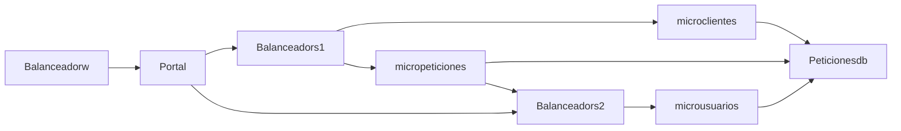

# Arquitectura

## Comunicacion entre Servicios
A continuación se gráfica la comunicación entre los servicios configurados en el docker compose.



### Servcios

Tenga en cuenta revisar la IP del servidorUbuntu para este ejercicio se utilizó la 192.168.100.2

Servicio | Url | Descripción
------------ | ------------ | -------------
Portal | http://192.168.100.2:8050 | Portal
microclientes | http://192.168.100.2:5081 | Servicio Microclientes
micropeticiones | http://192.168.100.2:5083 | Servicio Micropeticiones
microusuarios | http://192.168.100.2:5082 | Servicio Microusuarios
Balanceadorw | http://192.168.100.2:5080/ | Portal
Balanceadorw | http://192.168.100.2:5080/haproxy?stats | Estadisticas del Balanceador del Portal
Balanceadors1 | http://192.168.100.2:5081/ | Servicio Clientes
Balanceadors1 | http://192.168.100.2:5083/ | Servicio Peciciones
Balanceadors1 | http://192.168.100.2:5081/haproxy?stats | Estadísticas del Balanceador de los servicios de peticiones y clientes
Balanceadors2 | http://192.168.100.2:5082/ | Servicio Usuarios
Balanceadors2 | http://192.168.100.2:5082/haproxy?stats | Estadísticas del Balanceador del servicio de usuarios

### Consideraciones de despliegue Deshabilitadas

El archcivo de Docker compose tiene en comentario la configuración para desplegar los contenedores en determinados roles. Si se desea realizar esta prueba realice la configuración de acuerdo al docker-compose. La configruación está para una Arquitectura de 3 Capas: Presentación, Servicios  y Base de Datos y en medio de ellas los Balanceadores.

Capa | Servicio | Role
------------ | ------------ | -------------
Presentación | Portal | serverportal
Servicios | micropeticiones | serverservices
Servicios | microclientes | serverservices
Servicios | microusuarios | serverservices
Base de Datos | Peticionesdb | serverstorage
Balanceador | Balanceadorw | loadbalancer
Balanceador | Balanceadors1 | loadbalancer
Balanceador | Balanceadors2 | loadbalancer

#### Configuraciones

Este ejemplo de configuración es para un despliegue en 4 servidores

```sh
docker node update --label-add role=loadbalancer servidorUbuntu
docker node update --label-add role=portal clienteUbuntu
docker node update --label-add role=services servicesUbuntu
docker node update --label-add role=database storageUbuntu

```

### Configuración Portal

Servicio | Puerto del Contenedor | Puerto Host
------------ | ------------ | ------------
Portal | 80 | 3000

### Configuración Servicios

Servicio | Puerto del Contenedor | Puerto Host
------------ | ------------ | ------------
microclientes | 3001 | 3001
micropeticiones | 3003 | 3003
microusuarios | 3002 | 3002

### Configuración base de datos

Base de Datos | Puerto del Contenedor | Puerto Host
------------ | ------------ | ------------
Peticionesdb | 3306 | 32000

### Configuración Balanceadores

Balanceador | Puerto Host | Servicio | Puerto del Contenedor
------------ | ------------ | ------------- | -------------
Balanceadorw | 5080 | Portal | 80
Balanceadors1 | 5081 | microclientes | 3001
Balanceadors1 | 5083 | micropeticiones | 3003
Balanceadors2 | 5082 | microusuarios | 3002

### Servicio temporal de carga de información

El servicio insertadditionaldata, se utiliza para cargar la información inicial utilizando el archivo .cvs. Extrae los clientes y los usuarios y los crea en la base de datos de Peticiones en MySQL mediante codigo Python

### Procesos de escalamiento con Docker Swarn

Asegurece de tener configurado el cluster antes de ejecutar los siguientes comandos.
Todas las imégenes y sus contenedores inician por: "proyectofinal-"

```sh
# Desplegar el Docker Componse en el Swarm
docker stack deploy -c docker-compose.yml projectofinal

#Consultar los stack creado
docker stack ls 

#Consultar los servicios en los stacks
docker service ls 

#Consultar los contenedores en el servicio especificado
docker service ps projectofinal_microusuarios

#Escale un servicio
docker service scale projectofinal_microusuarios=2 

# Eliminar el stack
docker stack rm projectofinal 

```

### Pruebas de desempeño

El archivo de Jmeter Pruebas de Carga.jmx tiene un ejemplo configurado el cual con el solo inicio del stack no funciona. Se escala el servicio de microusaurios a 2 para que ya no arroje errores.


